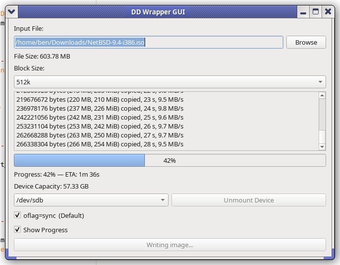
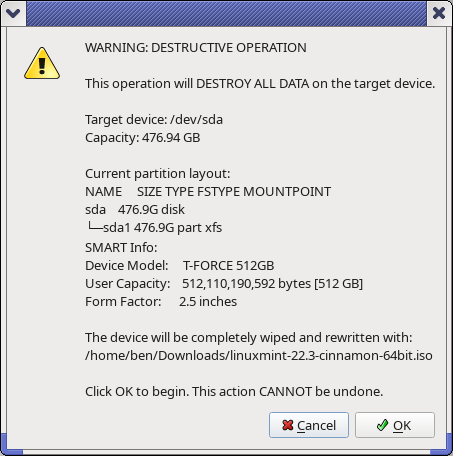

# DDWrap

**DDWrap** is a lightweight, safety-focused **Qt GUI wrapper for `dd`**, written in Python.

It is designed to make writing disk images to **USB flash drives and USB hard disks** more convenient, while staying honest about the risks involved in using `dd`.

> `dd` is powerful, destructive, and unforgiving.  
> DDWrap makes it easier to use — not safer to misuse.

---

## What It Does

DDWrap provides a graphical interface around `dd` that allows you to:

- Browse for image files (`.img`, `.iso`)
- Select a target block device (`/dev/sdX`)
- Choose a block size
- Automatically apply common `dd` flags
- View real-time progress and ETA
- Unmount devices before writing
- Confirm destructive writes with clear warnings

Under the hood, DDWrap still runs `dd`. Nothing is hidden.

### DDWrap in Action

The screenshot above shows DDWrap actively writing an image to a USB device, with real-time progress output, percentage complete, and estimated time remaining.

---

## Why It Exists

I use `dd` frequently.

All of my Linux and BSD images and ISOs live on a server, accessed via a mounted **NFS share** and organized by distribution. This results in long paths that I don’t want to type or copy/paste every time I write a USB stick.

I also *always* use the same flags:

- A block size (`bs=`) for performance
- `oflag=sync` to avoid buffered writes
- `status=progress` to see how much has been written and estimate time remaining

After doing this repeatedly, it became clear that this was a workflow problem.  
DDWrap exists to reduce repetition and friction while keeping the user fully aware of what’s happening.

Existing tools like **GNOME Disks** or **Raspberry Pi Imager** work, but they’re heavier, more opinionated, and don’t fit my workflow. I wanted something smaller, explicit, and transparent — so I built it.

---

## Safety Philosophy

DDWrap is designed to reduce **accidental mistakes**, not eliminate responsibility.

Before any write begins, DDWrap:

- Requires the target device to be **unmounted**
- Displays the **device size**
- Shows the **current partition layout**
- Displays **SMART device information** (when available)
- Requires explicit confirmation before starting

### Pre-Write Safety Confirmation

Before the write begins, DDWrap presents a final confirmation dialog showing the target device, capacity, partition layout, and SMART information (when available). This is the user’s last chance to verify that the correct device has been selected.

You can still wipe the wrong disk if you ignore the warnings.  
That is intentional. You must know your system.

---

## Device Scope (By Design)

DDWrap intentionally detects **traditional `/dev/sdX` devices** only.

This includes:
- USB flash drives
- USB hard disks
- USB SSDs

### NVMe Devices

NVMe devices (`/dev/nvme*`) are **not detected by default**, by design.

DDWrap is focused on removable media, where accidental overwrites of primary system disks are **less likely**.  
Advanced users may modify device detection logic if desired.

---

## Requirements

### Required

- Linux
- Python 3.9+
- PyQt6
- GNU userland tools:
  - `dd`
  - `lsblk`
  - `mount` / `umount`

DDWrap relies on **GNU `dd`**, specifically the `status=progress` option for real-time progress reporting.  
This option is not available in BSD/macOS `dd` and may be missing on some minimal Linux systems (e.g. BusyBox).

---

### Supported (Optional, Not Required)

These enhance functionality but are **not required**.

- **SMART support**
  - `smartctl` (from `smartmontools`)
  - Used only to display informational SMART data. If not installed, the feature simply won't be used.
- **Privilege escalation**
  - `sudo`, `doas`, or `pkexec`

If you do not have doas/sudo configured and installed, DDWrap must simply be run as root.

---

## Design Evolution

- Started as a simple GUI wrapper around `dd`
- Added device selection and privilege handling
- Introduced progress bar and ETA
- Added mounted-device detection and forced unmounting
- Expanded confirmation dialogs with size, layout, and SMART info

Each step focused on **convenience first**, with **safety always visible**.

---

## Final Note

DDWrap makes `dd` easier to use — not safer to ignore.

If you use this tool:
- Verify the target device
- Read the confirmation dialog
- Pay attention: If you need to unmount the target, **double-check** that it isn’t your game library or media collection on a secondary HDD.

`dd` can be dangerous. Use with care.
